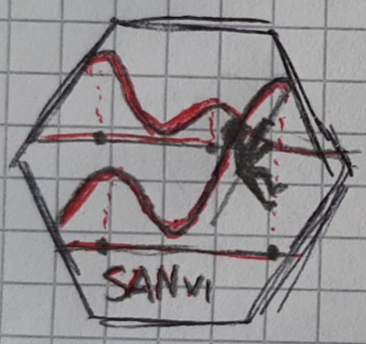

<!-- README.md is generated from README.Rmd. Please edit that file -->

```{r, include = FALSE}
knitr::opts_chunk$set(
  collapse = TRUE,
  comment = "#>",
  fig.path = "man/figures/README-",
  out.width = "100%"
)
```

# SANvi v0.1.0 


<!-- badges: start -->
 [](https://github.com/Fradenti/SANvi/actions/workflows/R-CMD-check.yaml)
 <!-- badges: end -->

The goal of SANvi is to estimate Bayesian nested mixture models via variational Bayes methods. Specifically, the package implements the common atoms model (Denti et al., 2023), its finite version (D’Angelo et al., 2023), and a hybrid finite-infinite model (D’Angelo and Denti, 2023+). All models use Gaussian mixtures with a normal-inverse-gamma prior distribution on the parameters. Additional functions are provided to help analyzing the results of the fitting procedure.

## Installation

You can install the development version of SANvi from [GitHub](https://github.com/) with:

``` r
# install.packages("devtools")
devtools::install_github("Fradenti/SANvi")
```

## Example

This is a basic example which shows you how to solve a common problem:

```{r example}
library(SANvi)
# Generate example data
set.seed(1232)
y <- c(rnorm(100),rnorm(100,5))
g <- rep(1:2,rep(100,2))

# Fitting fiSAN via variational inference
est <- SANvi:::variational_fiSAN(y,g,verbose = FALSE)
plot(est)

# Estimate clustering
cl <- estimate_clustering_vi(est)
cl
plot(cl,palette_brewed = T)
plot(cl,palette_brewed = T,type = "scatter")

# Estimate posterior atoms and weights
aw <- estimate_atoms_weights_vi(est)
aw
plot(aw)
```


# References

D’Angelo, L., Canale, A., Yu, Z., Guindani, M. (2023). Bayesian nonparametric analysis for the detection of spikes in noisy calcium imaging data. *Biometrics* 79(2), 1370–1382. \doi{10.1111/biom.13626}

D’Angelo, L., and Denti, F. (2023+). A finite-infinite shared atoms nested model for the Bayesian analysis of large grouped data sets. *Working paper*, 1–23.

Denti, F., Camerlenghi, F., Guindani, M., Mira, A., 2023. A Common Atoms Model for the Bayesian Nonparametric Analysis of Nested Data. *Journal of the American Statistical Association*. 118(541), 405–416. \doi{10.1080/01621459.2021.1933499}
