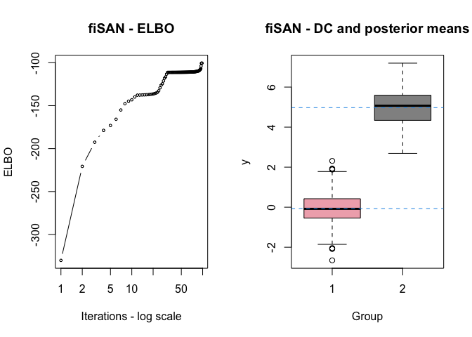
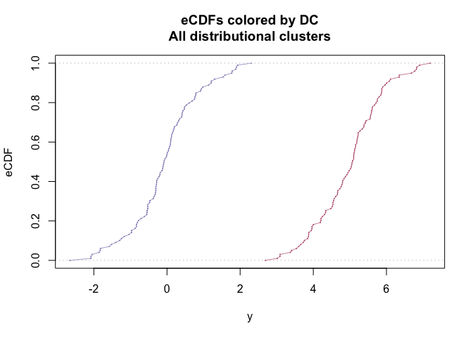
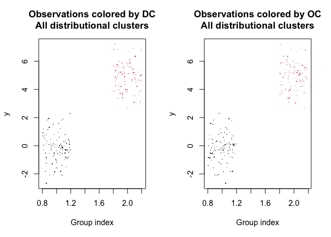
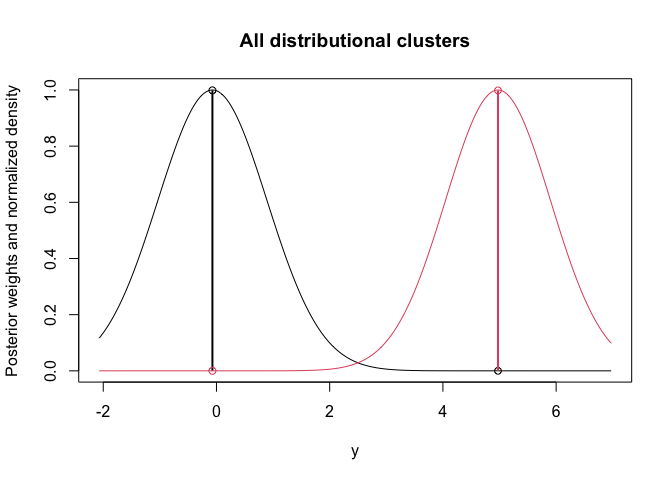

<!-- README.md is generated from README.Rmd. Please edit that file -->

# SANvi v0.1.0 

<!-- badges: start -->

[](https://github.com/Fradenti/SANvi/actions/workflows/R-CMD-check.yaml)
<!-- badges: end -->

The goal of SANvi is to estimate Bayesian nested mixture models via
variational Bayes methods. Specifically, the package implements the
common atoms model (Denti et al., 2023), its finite version (D’Angelo et
al., 2023), and a hybrid finite-infinite model (D’Angelo and Denti,
2023+). All models use Gaussian mixtures with a normal-inverse-gamma
prior distribution on the parameters. Additional functions are provided
to help analyzing the results of the fitting procedure.

## Installation

You can install the development version of SANvi from
[GitHub](https://github.com/) with:

``` r
# install.packages("devtools")
devtools::install_github("Fradenti/SANvi")
```

## Example

This is a basic example which shows you how to solve a common problem:

``` r
library(SANvi)
#> Loading required package: scales
#> Loading required package: RColorBrewer
# Generate example data
set.seed(1232)
y <- c(rnorm(100),rnorm(100,5))
g <- rep(1:2,rep(100,2))

# Fitting fiSAN via variational inference
est <- SANvi:::variational_fiSAN(y,g,verbose = FALSE)
plot(est)
```



``` r

# Estimate clustering
cl <- estimate_clustering_vi(est)
cl
#> Number of estimated OCs: 2 
#> Number of estimated DCs: 2
plot(cl,palette_brewed = T)
```



``` r
plot(cl,palette_brewed = T,type = "scatter")
```



``` r

# Estimate posterior atoms and weights
aw <- estimate_atoms_weights_vi(est)
aw
#> Atoms with posterior weight > 0.01 
#> ----------------------------------
#> Number of detected DCs: 2 
#> ----------------------------------
#> 
#> Distributional cluster # 1 
#>   post_mean post_var post_weight
#> 1    -0.071     0.93       0.999
#> 
#> Distributional cluster # 2 
#>   post_mean post_var post_weight
#> 2     4.973    0.861       0.999
plot(aw)
```



# References

D’Angelo, L., Canale, A., Yu, Z., Guindani, M. (2023). Bayesian
nonparametric analysis for the detection of spikes in noisy calcium
imaging data. *Biometrics* 79(2), 1370–1382.

D’Angelo, L., and Denti, F. (2023+). A finite-infinite shared atoms
nested model for the Bayesian analysis of large grouped data sets.
*Working paper*, 1–23.

Denti, F., Camerlenghi, F., Guindani, M., Mira, A., 2023. A Common Atoms
Model for the Bayesian Nonparametric Analysis of Nested Data. *Journal
of the American Statistical Association*. 118(541), 405–416.
